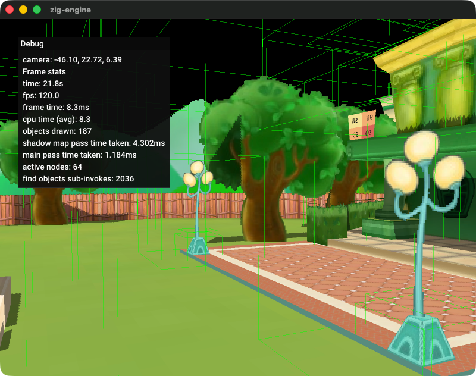
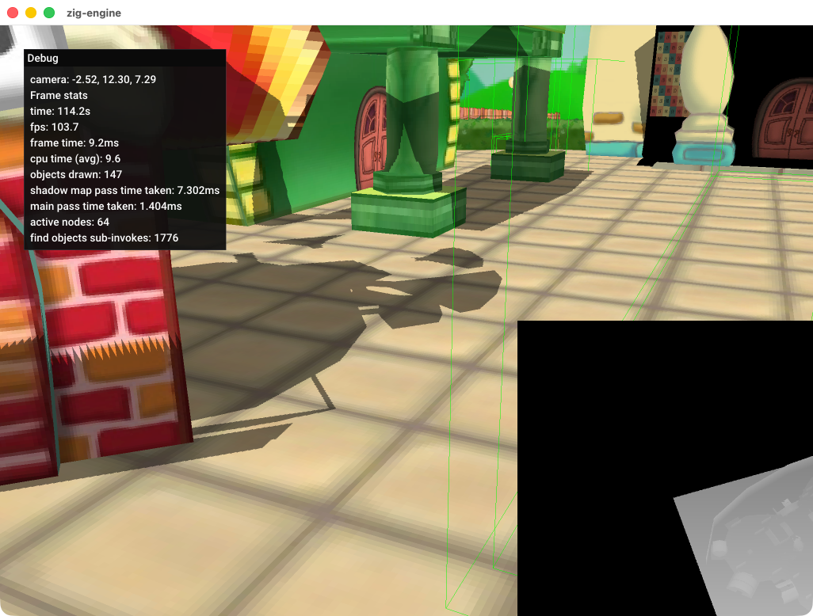
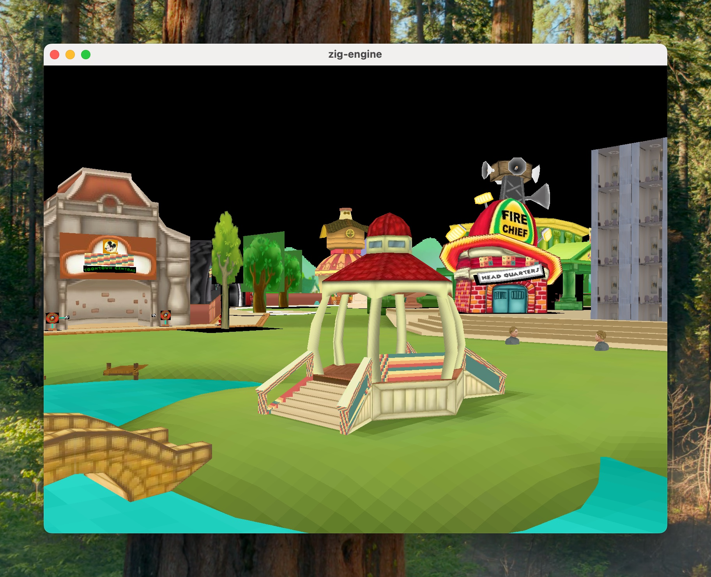
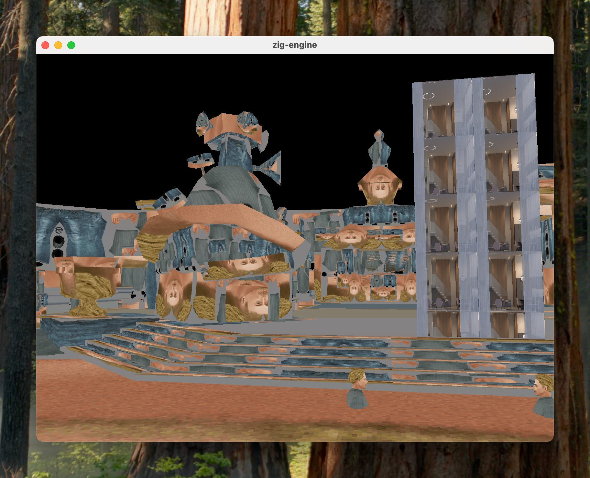
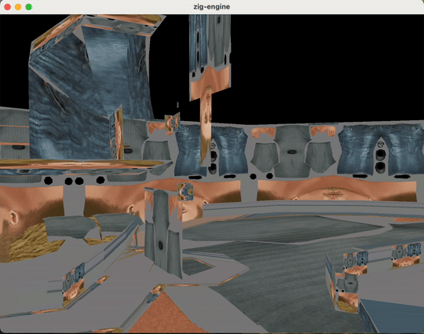

# zig-engine

A Zig 3D engine with a demo application and a voxel-world application. The engine renders scene objects, animated meshes, terrain, skyboxes, and voxels through WebGPU, with cascaded directional shadows and screen-space ambient occlusion (SSAO).

## Build and run

The package declares Zig 0.16.0 as its minimum version. External dependencies are pinned in `build.zig.zon`; the glTF loader is a local package.

```shell
zig build             # Build/install the library, both applications, and content
zig build run         # Run the demo application
zig build run_voxel   # Run the voxel application
zig build test        # Run registered unit/regression tests
```

The applications load installed content relative to the executable directory. See [architecture](docs/architecture.md) for the build and startup flow.

## Documentation

These documents describe the current implementation, extracted from existing docs and source. The initial extraction is for review; it does not establish that every implementation choice is intended behavior.

| Document | Contents |
| --- | --- |
| [Architecture and review points](docs/architecture.md) | Subsystem map, engine/application boundaries, state ownership, concurrency, startup, and frame order. Start here. |
| [Scenes, objects, and input](docs/scenes.md) | Scene contents, transform hierarchy, instance updates, current visibility index, controls, and lifetime. |
| [Rendering](docs/rendering.md) | Pass sequence, geometry paths, shadows, SSAO, GPU layouts, and current rendering limitations. |
| [Assets and animation](docs/assets-animation.md) | glTF subset, shared models, textures, per-object playback, and resource ownership caveats. |
| [Voxel world](docs/voxel-world.md) | Generation, service protocol, optimistic edits, streaming, masks, revisions, persistence, and capacity. |
| [Coordinates and rendering precision](docs/coordinates.md) | f64 CPU positions, signed chunks, camera-relative GPU coordinates, wrapping, and regression coverage. |

The subsystem docs link to implementing modules and existing tests. [TODO.md](TODO.md) is a task list. [Agent session logs](agent-sessions/README.md) are historical records.

## Controls

W/A/S/D move the spectator camera; Space/C move up/down. Hold the left mouse button to look around. Escape exits. E toggles SSAO, R toggles its debug view, and B toggles blur.

In the voxel app, Z places dirt and X removes the top solid block in the column below the camera, within 20 blocks of reach. These are vertical column tools. See [scenes and input](docs/scenes.md) and [voxel tools](docs/voxel-world.md#tools-and-simulation-example).

## Voxel app

The world-data service owns authoritative blocks and revisions. The main thread applies edits optimistically and reconciles them against subscribed snapshots. The normal neighborhood retains blocks in a 3×3×3 core and requests surrounding geometry within a 7×7×7 box; outstanding edits pin chunks during reconciliation. Both local and service meshes use neighbor boundary masks and the same exposed-face extractor.

The fixed GPU face buffer is 4 MiB. Capacity pressure reduces the outer box to 5×5×5; uploads remain pending if that still cannot fit. Modified blocks and permanent reveal flags survive subscription eviction in service memory. Disk persistence is not implemented. A separate simulation worker edits one surface block through its own service endpoint.

See [voxel world, streaming, and editing](docs/voxel-world.md) for the full protocol, handoff, meshing, and shutdown behavior.

## Large-world rendering

CPU positions and accumulated parent/child transforms use f64. GPU transforms remove a chunk origin before narrowing translation to f32. Camera and directional-shadow matrices use the same local frame; x wrapping matches the voxel world. Skyboxes use camera rotation only.

The active scene visibility index currently returns every registered object, without spatial culling. Voxel shadows include only resident GPU geometry. See [coordinates](docs/coordinates.md), [scenes](docs/scenes.md#visibility-behavior), and [rendering](docs/rendering.md).

## Versions

### v0.0.3

* Billboard render mode added



### v0.0.2

* Cascade shadow maps added



### v0.0.1



### v0.0.0



## Funny glitches


