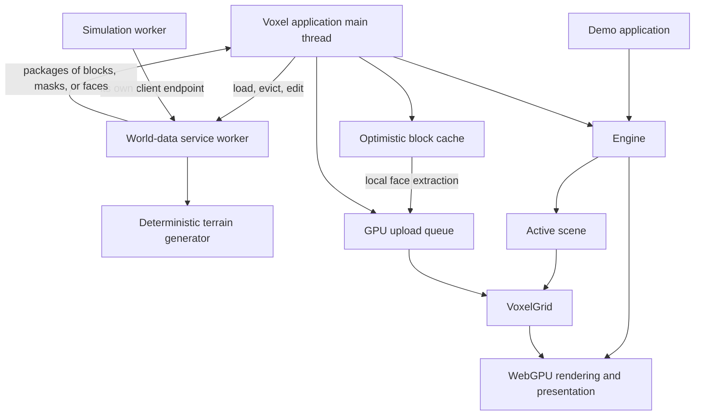

# Architecture as implemented

This is an initial description extracted from the source and existing documentation on 2026-10-06. It records current behavior for review; it is not a specification of the intended final engine. The review points below distinguish observations from decisions that still need the owner's input. The extraction used static source inspection, not a new visual or performance validation run.

## System overview

The project is a Zig 3D engine with two executable applications. The engine supplies a window integration, scene objects, camera controls, asset loading, GPU resources, and a fixed sequence of rendering passes. The demo application assembles a scene to exercise those facilities. The voxel application adds generated terrain, asynchronous world access, streaming, optimistic editing, and a small simulation worker.

The voxel world has three distinct kinds of state:

1. The world-data service's authoritative generated and modified blocks.
2. The main thread's block cache, with unacknowledged local edits applied on top of authoritative snapshots.
3. The engine's GPU geometry, which represents exposed faces rather than complete block contents.

Changes flow from application commands to the service and back through subscriptions. Rendering consumes the resulting geometry; it does not decide whether a block edit is valid.

The arrows show responsibilities and data flow, not separate processes. The service and simulation are concurrent tasks in the same application.

## Code map

| Location | Responsibility |
| --- | --- |
| [`build.zig`](../build.zig) | Per-application configured engine libraries, demo and voxel executables, content installation, run steps, and test aggregation. |
| [`src/engine/root.zig`](../src/engine/root.zig) | Public engine exports and selected third-party library exports. |
| [`engine.zig`](../src/engine/engine.zig) | Initialization, model registry, active scene, callbacks, render passes, and main loop. |
| [`scene.zig`](../src/engine/scene.zig) | Immutable world layout, reference to shared world pipelines, objects, groups, lights, camera/controller, instance buffer, and voxel grid. |
| [`world_layout.zig`](../src/engine/world_layout.zig) | Runtime dimension validation, coordinates, storage IDs, compile-time wrapping, and shader specialization. |
| [`world_pipeline_cache.zig`](../src/engine/world_pipeline_cache.zig) | Engine-owned world pipeline sharing, shader compatibility keys, reference counting, and final-release eviction. |
| [`game_object.zig`](../src/engine/game_object.zig), [`game_object_group.zig`](../src/engine/game_object_group.zig) | Transform hierarchy and per-object animation state. |
| [`pipelines/`](../src/engine/pipelines), [`bind_group_layouts/`](../src/engine/bind_group_layouts), [`shaders/`](../src/engine/shaders) | GPU pipeline construction, binding layouts, and WGSL behavior. |
| [`voxel/`](../src/engine/voxel) | Face records, upload queues, GPU residency, and slot allocation. |
| [`src/demo_app/main.zig`](../src/demo_app/main.zig) | Example scene construction, object updates, and GUI integration. |
| [`src/voxel_app/main.zig`](../src/voxel_app/main.zig) | Streaming policy, response reconciliation, tools, meshing, and upload coordination. |
| [`world.zig`](../src/voxel_app/world.zig) | Block contents, operations, local cache, and optimistic replay. |
| [`world_data_service.zig`](../src/voxel_app/world_data_service.zig) | Command ordering, authoritative revisions, subscriptions, batching, and retained modifications. |
| [`world_generator.zig`](../src/voxel_app/world_generator.zig), [`perlin_noise.zig`](../src/voxel_app/perlin_noise.zig) | Deterministic heightmap terrain and flat test terrain. |
| [`simulation_worker.zig`](../src/voxel_app/simulation_worker.zig) | A second world client that repeatedly edits one block. |
| [`gltf_loader/`](../gltf_loader) | Local glTF JSON, geometry, texture, skin, and animation input support. |

## Build and dependencies

`build.zig.zon` declares Zig 0.16.0 as the minimum version and pins the external dependencies. `zglfw` supplies window/input integration; `zgpu` supplies WebGPU/Dawn; `zgui` supplies the GLFW/WebGPU GUI backend; `zmath` supplies float matrix/vector operations; and `zstbi` supplies image decoding. The glTF loader is a local package.

Each application owns an `engine_config.zig` module injected into its engine build. X wrapping is enabled for the voxel app and disabled for the demo, with coordinate choices evaluated at compile time. The two engine libraries share dependency modules and artifacts. World dimensions remain runtime settings selected at scene creation.

| Command | Build step |
| --- | --- |
| `zig build` | Install both configured engine libraries, applications, and content. |
| `zig build run` | Build/install, then run the demo. |
| `zig build run_voxel` | Build/install, then run the voxel application. |
| `zig build test` | Run registered CPU tests, including coordinates/hierarchy under both wrapping configurations. |
| `zig build test-gpu` | Validate world pipelines, cache sharing/lifetimes, allocation cleanup, and GPU coordinate arithmetic through readback under both configurations with headless Dawn. |

Both applications change their working directory to the executable directory before loading assets. The build installs `content/` alongside the binaries. Asset lookup still mixes paths relative to the configured content directory with explicit `content/...` paths.

## Initialization and frame order

The application creates `WindowContext`, its own game state, and `Engine`, then loads models and creates a scene with explicit `WorldSettings`. The scene owns a validated immutable layout and acquires a reference to world pipelines in the engine cache. Unwrapped scenes share one set; wrapped scenes share when their x widths match. The first scene created becomes active. Other scenes can be allocated, but update and draw use only `engine.active_scene`. The caller must destroy all scenes before `Engine.deinit`; the final scene reference releases its pipeline set.

`Engine.init` enforces one live engine instance. It uses the graphics context supplied by `WindowContext`, creates pipelines and shared GPU resources, initializes image loading, and installs an input controller. Both example applications separately initialize and deinitialize the GUI backend.

`Engine.runLoop` prepares the initial active scene's instance buffer, then repeats:

1. Poll GLFW events. Key-press callbacks can execute application logic here.
2. Exit if the window closes or Escape is pressed.
3. Update elapsed engine time, reset frame statistics, and poll mouse state.
4. Update the active scene's camera aspect ratio and spectator controller.
5. Call the application's `onUpdate` callback. The voxel app performs world synchronization and uploads here.
6. Draw the active scene, post-process, and invoke `onRender` for overlays.
7. Submit GPU commands and present. Handle a reported swapchain resize.
8. Remove released keys from the held-key state.

There is no fixed simulation timestep in this loop. Camera movement uses frame elapsed time. Skeletal animation evaluation happens when an object is drawn, and skips repeated evaluations at the same engine time. The voxel service and simulation task progress independently of frame execution.

## Ownership and concurrency boundaries

| State/resource | Current controlling owner |
| --- | --- |
| Window and graphics context | Application's `WindowContext`. |
| Common pipelines, shared world pipeline cache, engine input controller, all models created by engine helpers | `Engine`. World pipeline sets are evicted on final reference release; models remain until engine teardown. |
| World layout, reference to cached pipelines, scene objects, cameras, groups, lights, instance buffer, voxel grid | `Scene`, which the application must destroy. |
| Special model pointers returned by loading helpers | Borrowed from `Engine`; tracked separately from regular model IDs. |
| Standalone textures returned by `loadTexture` | Caller; destroy after every borrowing model (normally after engine teardown). |
| Authoritative world state, client endpoints, request/reply queues | `WorldDataService`. Only its worker accesses authoritative state while running. |
| Local block cache, outstanding commands, streaming state | Voxel application's main thread. |
| Face arrays in a received mesh | Receiver, until ownership transfers to `VoxelGrid`'s upload queue. |

GPU operations run on the application thread. The service generates data and face records without accessing GPU resources. Each producer/consumer thread uses its own client endpoint; a client's request-ID counter is not a shared multi-thread API. Service mailboxes use short mutex-protected sections, and an allocator used by the service must support concurrent allocation.

The voxel app stops the simulation worker, submits any remaining local commands, and destroys the service before destroying its game state and engine. Service shutdown commits already submitted edits, skips pending generation work, and frees unconsumed replies. Modified world state exists only for the service lifetime.

## Read next

- [Scenes, objects, and input](scenes.md): object model, transforms, ownership, and controls.
- [Rendering](rendering.md): passes, geometry paths, shadows, and post-processing.
- [Assets and animation](assets-animation.md): asset import, model instances, playback, and resource limitations.
- [Voxel world](voxel-world.md): generation, protocol, cache reconciliation, streaming, and GPU capacity.
- [Coordinates and rendering precision](coordinates.md): CPU/GPU conversion rules and range guarantees.
- [World configuration](world-configuration.md): runtime dimensions, compile-time topology, validation, immutable ownership, and specialized pipelines.

## Review points

These are questions raised by the current implementation. Resolved decisions and investigated proposals are marked explicitly:

1. **Engine/application boundary (resolved).** Applications choose runtime dimensions at scene creation and optional x wrapping at compile time. The layout remains immutable, chunks stay fixed at 32³, and the engine shares specialized GPU pipelines across compatible scenes. The voxel app always wraps x. See [world configuration](world-configuration.md) and the [original research](world-configuration-options.md).
2. **Scene lifetime (resolved).** Applications own scenes; the engine owns all models created through its helpers, including its built-in debug wireframe cube. Objects borrow models and own their instance/animation state. Scene teardown clears the active pointer and releases instance resources; engine teardown asserts that all scenes are gone and releases shared assets and GPU resources. Standalone textures remain caller-owned. See [scene and model lifetime](scene-lifetime-options.md) for the ownership contract, retention tradeoff, and verification limits.
3. **Scene mutation.** Creation and transform updates are clear, but there is no complete public scene-object removal/index-reuse path. Is the current scene model intended mainly for setup followed by transform changes?
4. **Lighting.** Examples use one directional light. The API accepts several, but forward rendering reads the first light and all lights write the same shadow layers. What lighting contract should be supported?
5. **Simulation timing.** Camera movement is frame-driven, animation is draw-driven, and voxel commands are worker-driven. Is a separate fixed-step simulation an intended future requirement?
6. **Optimization policy.** Visibility queries temporarily perform no culling; voxel streaming has fixed boxes, permanent reveal flags, and a one-way radius reduction under capacity pressure. Which of these are acceptable lasting behavior, and which are temporary measures?

## Evidence and verification limits

The source links identify the implementing modules. The subsystem documents link to the relevant test files and describe what they cover. `agent-sessions/` contains historical session logs; those logs may explain past work but do not override current source behavior.

CPU tests do not establish full GPU rendering, resize, or multi-light correctness. The scene/model lifetime changes are additionally covered by headless Dawn resource-count and allocation-failure checks under both wrapping configurations. These exercise real teardown paths with the graphics context still alive, but do not validate window initialization, input callback behavior, or interactive appearance. Review corrections can distinguish a documentation error, an implementation bug, and a desired design change.
