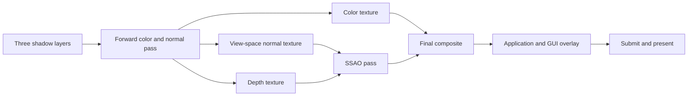

# Rendering as implemented

The engine has a fixed sequence of WebGPU passes assembled in `Engine.draw`. It renders the active scene into intermediate textures, applies screen-space ambient occlusion (SSAO), composites to the swapchain, then draws application/GUI overlays. This document describes that sequence and its current constraints.

## Frame data and pass order

Before encoding passes, the engine fits directional-light cascades, collects object candidates for every cascade and the camera, refreshes dirty/billboard instance transforms, and uploads the changed instance range. The current visibility index returns every registered object for each query.

| Stage | Current behavior |
| --- | --- |
| Shadows | One pass for each of three cascades per scene light; writes an `r32_float` layer with a separate depth attachment. |
| Forward scene | Clears and renders color (`rgba8_unorm`), encoded view-space normals (`rgb10_a2_unorm`), and depth. Some pipelines disable normal writes. |
| SSAO | Full-screen pass reconstructs view-space positions from depth and uses the normal texture to estimate occlusion; output is `r16_float`. |
| Final composite | Full-screen pass copies scene color or multiplies it by SSAO. Optional blur/debug display are applied here. |
| Overlay | If `onRender` exists, loads the swapchain color without a depth attachment, invokes the application callback, and renders GUI when enabled. |

The SSAO pass is still encoded when SSAO is disabled. The final shader bypasses its result in that case. GUI frame creation and the engine debug window currently occur inside the optional `onRender` branch.

## Geometry paths

Regular meshes use position, normal, UV, and index buffers. Skinned meshes additionally use four joint indices and weights per vertex. Models share GPU mesh data, while each object references its own instance index. Each object/mesh is submitted separately; the current renderer does not combine all instances of one model into one draw.

Colorized primitives and window boxes use their own pipeline/bindings. A window box receives the camera position transformed into model space. Height-map terrain constructs vertices in WGSL from a sampled integer height texture; the grid side is currently fixed to 64. It is a different terrain representation from the voxel application's generated block world.

Skyboxes use camera rotation and projection, omitting translation. The dedicated cubemap skybox is drawn separately before voxels and the queried ordinary objects. Skyboxes are excluded from shadow casting.

CPU world transforms remain in `f64`. GPU paths use chunk-local matrices plus integer chunk coordinates, with a camera/cascade chunk origin. Integer chunk subtraction and optional x wrapping happen before conversion to meters. The application selects wrapping at compile time. Scenes acquire a reference to six specialized pipelines in the engine cache: unwrapped scenes share one set, and wrapped scenes share by x width. Unwrapped shaders omit periodic arithmetic and width/mask constants. Common pipelines stay engine-owned. See [world configuration](world-configuration.md) and [coordinates](coordinates.md); using an absolute-world `f32` matrix would break the large-position guarantees.

## Voxel rendering

The voxel grid stores exposed-face records, not a conventional indexed mesh or a dense GPU block array. Each record contains local block coordinates and block type in four bytes. Six lists group those records by outward face direction. The vertex shader generates six vertices per face and selects atlas UVs using block type and direction.

Chunk metadata describes eight combinations of three directions, one direction from each axis. The draw's instance index encodes the chunk metadata index and the selected direction combination. The visible pass chooses a combination from the signed camera/chunk delta. When any delta component is zero, it draws opposite combinations 0 and 7 to cover all six sides. This selection affects submitted faces, not the authoritative mesh contents.

Each shadow cascade draws combinations 0 and 7 for every GPU-resident voxel chunk, regardless of camera direction. Thus the same resident geometry supplies both visible and shadow passes. Chunks that have no uploaded faces are absent from that loop; distant unloaded terrain does not cast voxel shadows.

The CPU/WGSL layouts are part of the contract: chunk metadata is 112 bytes, face records are four bytes, ordinary instances are 80 bytes. Changes must keep the shader declarations and upload layout synchronized.

## Directional shadows and light limitations

A light records a direction, color, and intensity, and has three cascades. Each cascade is anchored at the camera chunk. Its orthographic projection is fitted to a camera-frustum extent in light space, using fixed depth parameters and a light-height range of 300. Each shadow layer is 1024 by 1024.

Regular meshes, skinned meshes, primitives, window boxes, height-map terrain, and resident voxel geometry cast shadows. Terrain's visible and shadow shaders share the height-derived vertex function; voxel shaders likewise share face-derived geometry. Shadow sampling uses the same chunk frame as casting.

The mesh (including skinned meshes), voxel, and height-map fragment shaders share [`shadow_map/sampling.wgsl`](../src/engine/shaders/shadow_map/sampling.wgsl). Each pipeline prepends it to its fragment source using Zig's compile-time `@embedFile` and string concatenation, with no runtime preprocessing or source allocation. Its `shadowFactor` function takes the texture, sampler, and three light-space positions, keeping it independent of the pipeline's bind group indices. New fragment shaders can embed the same file and call the function before alpha discard.

The shared function samples all three layers before cascade-dependent branches, keeping implicit texture derivatives in uniform control flow. It selects the tightest applicable cascade (2, then 1, with 0 as the fallback), compares sampled depth with biases of 0.002, 0.008, and 0.02 respectively, and returns 0.5 for shadowed color or 1.0 otherwise. The callers multiply RGB by this factor, preserve alpha, and discard fragments with alpha below 0.25 in the visible pass. The mesh shadow path renders geometry without sampling that alpha texture, so transparent cutouts and shadows need separate validation.

The current API is broader than the effective light behavior:

- Forward paths access `scene.lights.items[0]`, so an active rendered scene assumes at least one light.
- Shadow passes iterate all lights, clearing and rewriting the same three shared layers. They do not allocate independent shadow textures per light.
- Light color and intensity are stored in `DirectionalLightParams`, but the inspected rendering paths do not pass them to the shading calculation.

The examples use one directional light. These observations do not establish support for multiple lights or a general diffuse/specular lighting model.

## SSAO and final composition

SSAO uses a 16-sample kernel and a repeated 4-by-4 noise pattern. Depth is reconstructed into view space using the inverse projection. The sample radius is 0.5 and bias is 0.025. Normal values are encoded from [-1, 1] into [0, 1] and decoded in the SSAO shader.

The final shader optionally applies a weighted 3-by-3 blur to the SSAO texture, multiplies RGB by the resulting occlusion factor, and preserves alpha. Debug mode displays the factor as grayscale. E, R, and B control enablement, debug display, and blur respectively.

## Resize and diagnostics

After presentation reports a swapchain resize, the loop updates screen size/aspect ratio and recreates the depth, color, normal, and SSAO textures. The next scene update refreshes the camera projection.

**Review point:** `recreateScreenDependantTextures` recreates those textures, but does not recreate the SSAO/final bind groups that were constructed with their original views. The static code path therefore does not establish correct rebinding after resize. This is an implementation concern to verify, not a documented promise that resizing is complete.

Frame statistics include candidate object count, uploaded instance-range size, visibility-index counters, and shadow/main-pass elapsed times. The timers wrap CPU pass encoding; they are not GPU timestamp measurements. The object count is the queried ordinary-object list length, excluding voxel face draws and the separate cubemap skybox.

## Sources and verification

- [`engine.zig`](../src/engine/engine.zig): `draw`, `drawGameObject`, `drawGameObjectToShadowMap`, transform adjustment, and resize handling.
- [`light.zig`](../src/engine/light.zig): cascade fitting and camera-relative origins.
- [`pipelines.zig`](../src/engine/pipelines.zig), [`pipelines/`](../src/engine/pipelines), and [`bind_group_layouts/`](../src/engine/bind_group_layouts): pipeline and binding configuration.
- [`shaders/basic/`](../src/engine/shaders/basic), [`shaders/voxel/`](../src/engine/shaders/voxel), [`shaders/shadow_map/`](../src/engine/shaders/shadow_map), and [`shaders/quad/`](../src/engine/shaders/quad): vertex generation, shadow comparisons, and post-processing.
- [`render_coordinates_tests.zig`](../src/engine/render_coordinates_tests.zig): agreement of camera/shadow projections and translation invariance across all cascades.
- [`world_shader_tests.zig`](../src/engine/world_shader_tests.zig), [`world_coordinate_readback.zig`](../src/engine/world_coordinate_readback.zig): headless production-pipeline validation, cache lifetimes, and numerical GPU/CPU coordinate comparison through compute/readback.
- [`voxel_tests.zig`](../src/engine/voxel_tests.zig): face/upload data and allocator behavior without creating a GPU device.

`zig build test` exercises the registered CPU tests under both application wrapping configurations. `zig build test-gpu` separately validates the six specialized pipelines and their cache sharing, reference lifetimes, and allocation cleanup with headless Dawn in each compiled wrapping mode. It also validates the height-map pipeline, covering every pipeline that embeds the shared shadow sampler, and executes the production coordinate helper to compare GPU readback with CPU results at seams, half-period ties, f32 precision boundaries, and signed i32 limits, using three world widths. These checks do not replace a runtime visual check of rendering, alpha/shadow agreement, SSAO, or resize.
